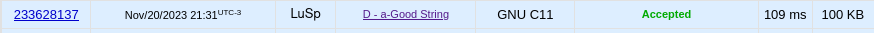

# D. a-Good String

Link da questão: https://codeforces.com/contest/1385/problem/D

## Resultado

## Explicação do codigo

A explicação pode ser encontrada clicando [Aqui!]()  
O vídeo também pode ser encontrado na pasta "Assets" do repositório!