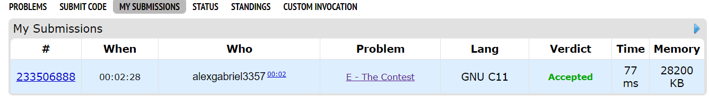

#4. E. The Contest

A team of three programmers is going to play a contest. The contest consists of n
 problems, numbered from 1
 to n
. Each problem is printed on a separate sheet of paper. The participants have decided to divide the problem statements into three parts: the first programmer took some prefix of the statements (some number of first paper sheets), the third contestant took some suffix of the statements (some number of last paper sheets), and the second contestant took all remaining problems. But something went wrong — the statements were printed in the wrong order, so the contestants have received the problems in some random order.

The first contestant has received problems a1,1,a1,2,…,a1,k1
. The second one has received problems a2,1,a2,2,…,a2,k2
. The third one has received all remaining problems (a3,1,a3,2,…,a3,k3
).

The contestants don't want to play the contest before they redistribute the statements. They want to redistribute them so that the first contestant receives some prefix of the problemset, the third contestant receives some suffix of the problemset, and the second contestant receives all the remaining problems.

During one move, some contestant may give one of their problems to other contestant. What is the minimum number of moves required to redistribute the problems?

It is possible that after redistribution some participant (or even two of them) will not have any problems.

## Input
The first line contains three integers k1,k2
 and k3
 (1≤k1,k2,k3≤2⋅105,k1+k2+k3≤2⋅105
) — the number of problems initially taken by the first, the second and the third participant, respectively.

The second line contains k1
 integers a1,1,a1,2,…,a1,k1
 — the problems initially taken by the first participant.

The third line contains k2
 integers a2,1,a2,2,…,a2,k2
 — the problems initially taken by the second participant.

The fourth line contains k3
 integers a3,1,a3,2,…,a3,k3
 — the problems initially taken by the third participant.

It is guaranteed that no problem has been taken by two (or three) participants, and each integer ai,j
 meets the condition 1≤ai,j≤n
, where n=k1+k2+k3
.

## Resultado

Enviado ao juiz online!

## Explicação do codigo

A explicação pode ser encontrada na pasta "Assets" do repositório!

## Referência

O exercício se encontra no link abaixo:
- [codeforces](https://codeforces.com/contest/1257/problem/E)
